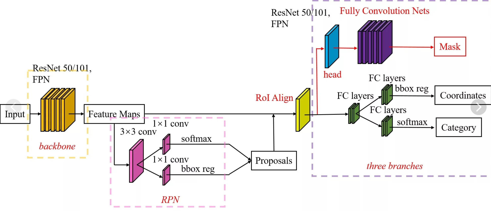

### Parking Car Object Detection

Features:

- Mask-RCNN Architecture
- ResNet101 as backbone
- Transfer Learn based on coco pretrained weights
 

Mask rcnn at a glance:

Resulting output:

Model is still training...
